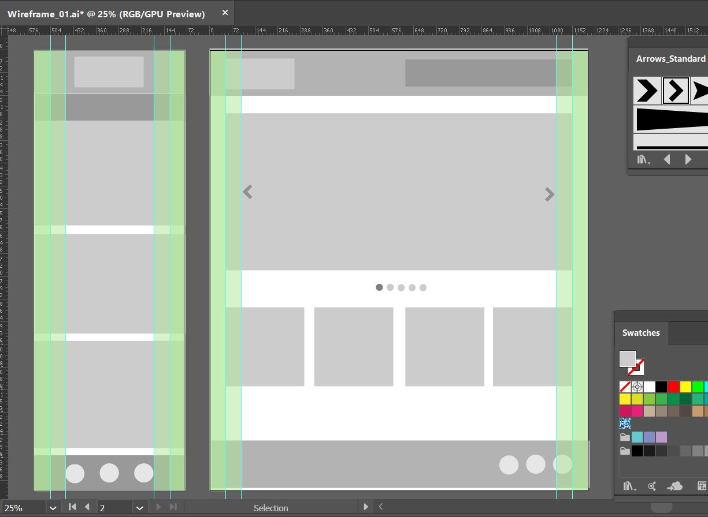

# misc
Adobe_Illustrator, etc.

# PHASE ONE - B & W Main Layout
Mobile: Header (with logo), Nav, main content x 3, footer with three icons
Desktop: Header (with log0), Nav inside header, Hero section with carousel, 5 selection buttons, 4 main, nav with three icons
Notes, using .ai side by side mobile (480x1400) and desktop (1200x1400) views
Commands to review, F (move screens), CTRL + O center, CTRL + R - hide show rulers, CTRL + U smart guides, M - rectangle tools, F7 layers, CTRL + " grid toggle, to duplicate: select, ALT + drag, perfect circle: hold down shift
